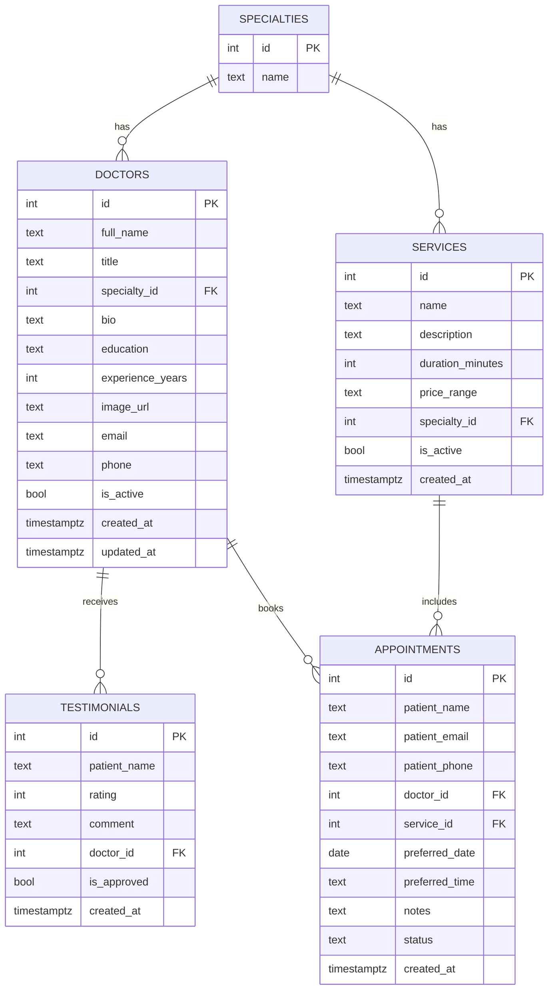

## ER-диаграмма (Dental College)

Краткое описание сущностей и связей:
- SPECIALTIES: справочник направлений. 1 ко многим с DOCTORS и SERVICES.
- DOCTORS: врачи. Имеют отзывы и записи на прием.
- SERVICES: услуги. Включаются в записи на прием.
- TESTIMONIALS: отзывы пациентов, связаны с врачом.
- APPOINTMENTS: заявки пациентов, связывают пациента с врачом и услугой.

Нормализация: таблицы удовлетворяют 3НФ; неключевые атрибуты зависят только от ключей, справочники вынесены отдельно, повторяющиеся группы отсутствуют.

